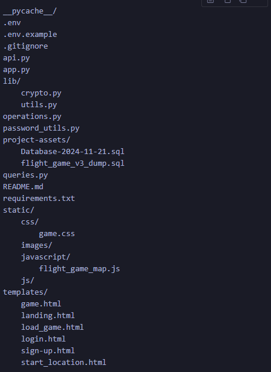

## Ohjelmisto-2-project
### Overview
This project is a flight game built using Flask for the backend and Vanilla JavaScript for the frontend. The game allows players to fly to different airports around the world, answer trivia questions, and manage their in-game money.

## Technologies
Flask
TailwindCSS for styles
Vanilla JavaScript
Vanilla HTML

## Project Structure

## Database

## Setup Instructions
### Clone the repository:
`git clone <repository-url>`
`cd <repository-directory>`

### Create a virtual environment:
`python -m venv venv`
`source venv/bin/activate  # On Windows use venv\Scripts\activate`

### Install the dependencies:
`pip install -r requirements.txt`

### Set up the environment variables:

- Copy the .env.example file to .env and fill in the required values:
`cp .env.example .env`

### Run the database migrations:
`mysql -u <your_db_user> -p <your_db_name> < project-assets/flight_game_v3_dump.sql`

Ensure you have a MySQL database running and accessible with the credentials provided in the .env file.
Import the SQL dump file to set up the initial database schema and data:

### Run the application:
`python app.py`

### Usage Instructions
- Sign Up:
Navigate to /sign_up to create a new account.

- Log In:
Navigate to /login to log in with your credentials.

- Start a New Game:
After logging in, navigate to /start_location to select a starting location and begin a new game.

- Load an Existing Game:
Navigate to /load_game to load a previously saved game.

- Play the Game:

Navigate to /game/<game_id> to play the game. You can fly to different airports, answer trivia questions, and manage your in-game money.

Log Out:
Navigate to /logout to log out of your account.
